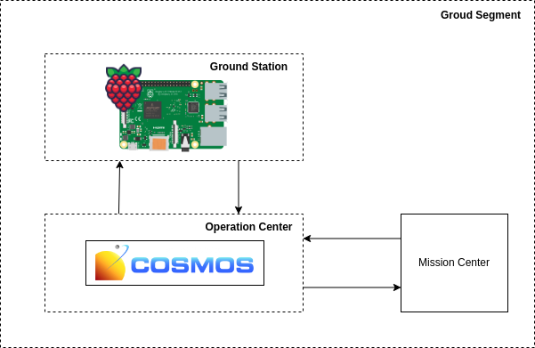

# Space Operations Center (SOC)

A Space Operations Center (SOC) is a facility such as a Mission Control Center for controlling spaceflight and/or spacelift missions. She is responsible for the communication between the antennas (TT&C) and the Mission Control Center (MCC).

To simulate the communication of these two subsystems present in the Ground System, this work aims to use the knowledge acquired in SIS-20 (Ground System) to END and CAPTURE commands using bit packets in order to enable, in a summarized way using COSMOS , the analysis of this subsystem locally.

## Tools

### Simulate Space Operations Center (SOC)

For the simulation of the operation center, the [COSMOS](https://ballaerospace.github.io/cosmos-website/) tool from [Ball Aerospace](https://ballaerospace.github.io/) was used. It is a free tool with a user interface to perform Commands and Control of Embedded Systems.

To install COSMOS just follow the [Installation Guide COSMOS](https://ballaerospace.github.io/cosmos-website/docs/v5/installation).

### Simulate Satellite and TT&C

The [Core Flight System (cFS)](https://github.com/nasa/cFS) is a generic flight software architecture framework used on flagship spacecraft, human spacecraft, cubesats, and **Raspberry Pi**. 

[COSMOS](https://ballaerospace.github.io/cosmos-website/) has an integration with cFS, in which cFS is used as an external agent that sends and receives COSMOS telecommands. This integration is descript in [COSMOS and NASA cFS](https://ballaerospace.github.io/cosmos-website/docs/v5/cfs).

